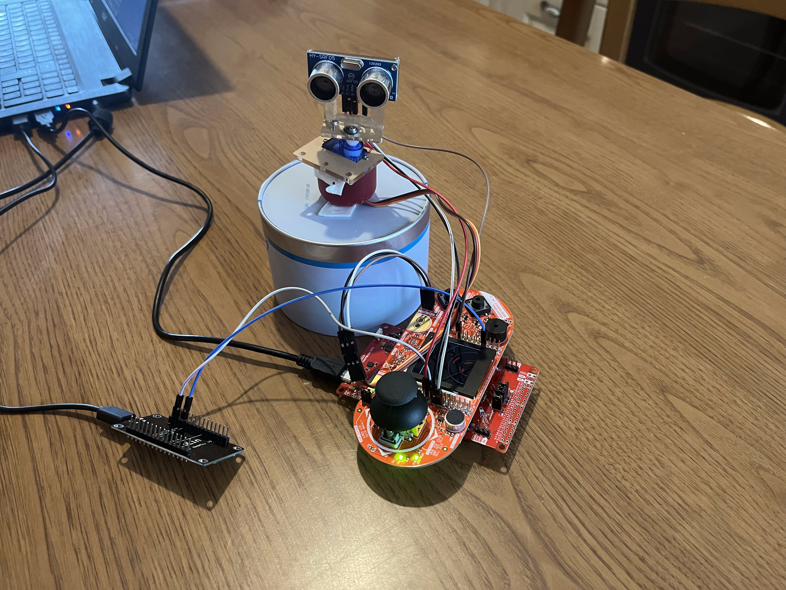
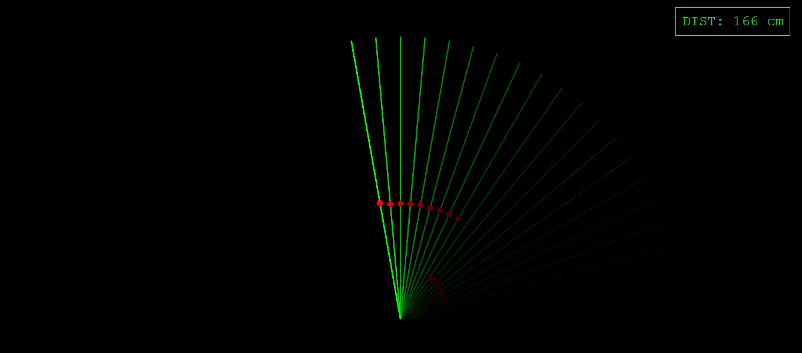

# Moving Ultrasound Radar

## Project overview
This project uses an MSP432P401R to coordinate various elements to create a radar which rotates and scans the surrounding entities, showing them on a display and also on a web page by using an IoT implementation.

## System Requirements

### Hardware Components
The project integrates several components to create the dual-interface radar:
* **Microcontroller:** Texas Instruments **MSP432P401R** (LaunchPad).
* **IoT Module:** **ESP-12E** (NodeMCU or similar ESP8266-based board).
* **Ultrasonic Sensor:** **HY-SRF05** (for distance measurement).
* **Actuator:** **SG90 Servo Motor** (for 180° rotation).
* **Boosterpack:** **Boosterpack EDU MKII** Used for showing the radar map on the display and for making connections via jumper wires.
* **Passive Components:** Jumper wires.

### Software & Tools
To compile, upload, and run the code, you will need:
* **Code Composer Studio (CCS):** Used for programming the MSP432 (C language, using DriverLib).
* **Arduino IDE:** Used for flashing the ESP-12E (C++ with ESP8266 Core).
* **Web Browser:** (Chrome, Firefox, or Safari) to access the IoT Dashboard.

## How it works
The core of this project is the MSP432P401R board, which coordinates each module to ensure they work together seamlessly. The system consists of specific wiring between components (detailed later in this document) and a custom physical mount for the SG90 servo, which allows the HY-SRF05 sensor to rotate from 0° to 180°. This setup enables the sensor to scan the environment and detect nearby objects up to 4 meters away.

The MSP432 controls the servo using a timer in PWM (Pulse Width Modulation) mode; the servo determines its rotation angle based on the received duty cycle. After each movement of the servo, the MSP432 triggers the ultrasonic sensor. By using a hardware timer register, the system tracks exactly when the trigger was sent and waits for the response.

At this stage, two cases are distinguished:
* **Object detected**: The sensor sends an echo signal back to the MSP432. The board captures a second timer value and calculates the difference (time-of-flight) to compute the object's distance.
* **No object detected**: To prevent the system from waiting indefinitely, a timeout interrupt is used. This interrupt triggers if too much time passes without a return signal, indicating that no object is within range.

In both cases, the MSP432 will go to low-power mode and will wake up only when an interrupt will happen. Then, the board processes the data to update the radar map on the BoosterPack display and simultaneously sends the information to the ESP-12E module to be visualized on a web page.

## Project Layout

```
.
├── IoT/                        # ESP-12E WiFi & Web Server
│   └── setup_ESP12E/
│       └── setup_ESP12E.ino    # Arduino sketch (HTML/JS Dashboard)
├── MSP-project/                # MSP432 Main Firmware
│   ├── main.c                  # Application entry point
│   ├── fsm/                    # Finite State Machine logic
│   ├── ultrasound-sensor/      # Sensor HY-SRF05 driver (distance measurement)
│   ├── Servo/                  # SG90 PWM control
│   ├── Display/                # Radar drawing functions on the Boosterpack display
│   ├── LcdDriver/              # Driver with functions useful for the Boosterpack display
│   └── iot_wifi/               # UART communication with ESP-12E      
├── tests/                      # Project testing
├── assets/                     # Projects images and presentation
└── README.md                   # Project documentation 
```

## Getting started
In order to build and run this project, first it is needed to complete the circuit by wiring the components together with jumper wires.

### Pinout and connections
Firstly, the boosterpack has to be mounted by stacking it directly on top of the MSP432 headers. Then, it is possible to wire the other components. Below are the specific wiring tables for each component. **Note:** All components must share a common **GND**.

### 1. Ultrasonic Sensor (HY-SRF05)
| HY-SRF05 Pin | MSP432 Pin | Description |
| :--- | :--- | :--- |
| **VCC** | 5V | Power Supply |
| **Trig** | J1.3 on the Boosterpack, that maps to P3.2 on the MSP | Trigger Signal (Output) |
| **Echo** | J1.4 on the Boosterpack, that maps to P3.3 on the MSP | Echo Signal (Input - Interrupt) |
| **GND** | GND | Ground |

### 2. Servo Motor (SG90)
| SG90 Wire Color | MSP432 Pin | Description |
| :--- | :--- | :--- |
| **Red** | 5V | Power Supply |
| **Orange** | J2.19 on the Boosterpack, that maps to P2.5 on the MSP | PWM Control Signal |
| **Brown** | GND | Ground |

### 3. IoT Module (ESP-12E)
| ESP-12E Pin | MSP432 Pin | Description |
| :--- | :--- | :--- |
| **VCC** | 3.3V / 5V | Power Supply |
| **RX** | J4.34 on the Boosterpack, that maps to P2.3 on the MSP | UART Data In (from MSP TX) |
| **GND** | GND | Ground |



### Running the project
After all the connections have been done, it is possible to download the project to your PC and run it. Below is a step-by-step explanation of how to accomplish that.

1. **Clone the repository**
Download the project on your PC.

2. **Open CCS**
Import the `MSP-project` folder into Code Composer Studio.

3. **Include paths and Linker files**
Make sure you have the `simplelink_msp432p4_sdk_3_40_01_02` SDK available in your workspace, since it is required to resolve the project's include paths and header dependencies in Code Composer Studio. Precisely, we will be using the Driverlib and the Grlib functions. Here is explained how to include the right paths in your project:  
- Open CSS and right click on Project Folder to select Properties  
- Select CSS Build  
- Click ARM Compiler and then Include Options  
* Add "simplelink_msp432p4_sdk_3_40_01_02/source" directory to "Add dir to #include search path" window.  
- Click ARM Linker and File Search Path  
* Add "simplelink_msp432p4_sdk_3_40_01_02/source/ti/devices/msp432p4xx/driverlib/ccs/msp432p4xx_driverlib.lib" to "Include library file..." window  
* Add "simplelink_msp432p4_sdk_3_40_01_02/source/ti/grlib/lib/ccs/m4/grlib.a" to "Include library file..." window  

4. **Open Arduino IDE**
To use the IoT part of the project, it is necessary to flash the setup onto the ESP-12E. Here is an explanation on how to accomplish that:  
- Arduino IDE Configuration: Open Arduino IDE, go to **File > Preferences**, and paste the following URL into the "Additional Boards Manager URLs" field:  
   `http://arduino.esp8266.com/stable/package_esp8266com_index.json`  
- Install ESP8266 Core: Navigate to **Tools > Board > Boards Manager**, search for "esp8266", and click **Install**.  
- Select Board: Go to **Tools > Board** and select **"NodeMCU 1.0 (ESP-12E Module)"**.  
- Port Selection: Connect your ESP-12E to the PC and select the corresponding COM port under **Tools > Port**.  
- Flash the Firmware: Open the `.ino` file located in the `IoT/setup_ESP12E` folder and click the **Upload** button (the right-arrow icon).  

5. **Ready to run** The project is now ready to build. On CCS, click on the Debug button and, once the project is built, click on the Resume button. The code will begin to run on the MSP and everything will work. The last step is to view the web page of the IoT part.


6. **Viewing the web page** First, you need to connect to the Wi-Fi generated by the ESP-12E on your computer or mobile phone. The network is named "MSP432_Radar" and the password is "12345678". Once you are connected, open your browser and navigate to http://192.168.4.1. If everything has been done correctly, the web page will show the radar map with the entities that are being scanned.



## Link to the project presentation
[Link to the project PDF presentation](assets/Moving%20Ultrasound%20Radar.pdf)

## Link to the Youtube video

## Team members and contribution
The team as a whole collaborated on the main logic and the Finite State Machine (FSM) implementation. Individually, the members divided the tasks as follows:
* Rocco Intini: Development of the IoT architecture and the HTML interface for radar visualization.
* Leonardo Maria: Data visualization on the local display.
* Lorenzo De Biasi: Handle of the servo-driven radar movement.
* Gabriele Gonzato: Sensor configuration and calibration.